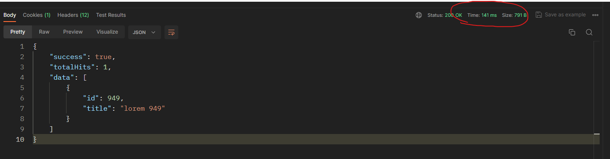
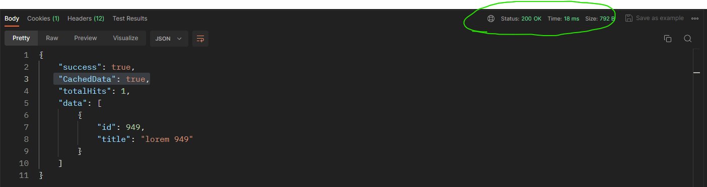

# Django REST Framework + Redis Cache
This repository serves as a test for integrating Django REST Framework with Redis Cache. Explore the interaction between Django's powerful API framework and the caching capabilities of Redis.

## Features
1. Django REST Framework integration
2. Redis Cache setup for efficient data caching
3. Django Debug-Toolbar for Visual Representation

## Demo Showcase




## Getting Started

**_Make Sure Python is installed on your Machine with PIP File Path Setuped_**

1. Clone the Project

```

   git clone https://github.com/MrAalu/Redis-Django

```

2. Create Virtual Environment (Windows)

**_If you're using Linux/Mac then you can lookup 'how to create python django virtual environment on linux/mac'_**

```

   py -m venv env

```

3. Activate Virtual Environment (WINDOWS)

```

   env\Scripts\activate

```

4. After Virtual Environment is Activated ,Install Required Packages

```

    pip install -r requirements.txt

```


5. Models Migrations

```

    py manage.py makemigrations

```

6. Models Migrate

```

    py manage.py migrate

```

7. Populate Database with Dummy Data

```

    py manage.py loaddata populateDatabase.json

```

8. Run the Server

```

    py manage.py runserver

```